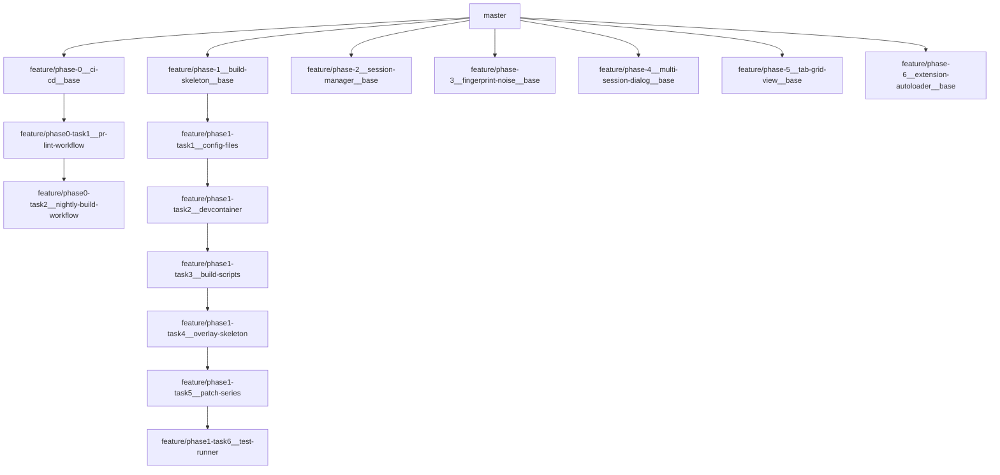

# Chromeleon 実装計画

> **For agentic workers:** REQUIRED SUB-SKILL: Use superpowers:subagent-driven-development (recommended) or superpowers:executing-plans to implement this plan task-by-task. Steps use checkbox (`- [ ]`) syntax for tracking.

**Goal:** Chromium M135 をベースに、タブ単位セッション分離・アンチフィンガープリント・グリッド UI・コンテキストメニュー拡張・拡張自動ロードを備えたカスタムブラウザ「Chromeleon」を構築する。

**Architecture:** Brave 式 overlay + 薄いフックパッチ（合計 ~65 行）で上流 Chromium への侵襲を最小化する。オーバーレイコードは `chromium_src/overlay/` に配置し symlink で Chromium ソースツリーに注入。5 つのサブシステム（EphemeralSessionManager / FingerprintNoiseSource / TabGridView / MultiSessionOpenDialog / PartitionExtensionAutoloader）を KeyedService・Supplement・Observer パターンで連携させる。

**Tech Stack:** C++20, Chromium M135 (GN + Ninja), Mojo IPC, Python 3.12 (ビルドスクリプト), GitHub Actions CI

**Design Spec:** [2026-04-21-chromium-multisession-fork-design.md](../specs/2026-04-21-chromium-multisession-fork-design.md)

---

## ブランチ戦略の概要



**ルール:**

- **Phase ブランチ**: 常に `master` から作成 → `master` へ Draft PR
- **Task ブランチ**: 直前の Task（または Phase ベース）から派生 → Phase ブランチへ Draft PR
- 前 Phase が `master` にマージされるまで次 Phase は開始しない

---

## Phase 0: CI/CD Foundation

> **Phase ブランチ:** `feature/phase-0__ci-cd__base` ← `master`
> **PR ターゲット:** `master`

### Task 0-1: PR Lint ワークフロー

**ブランチ:** `feature/phase0-task1__pr-lint-workflow` ← `feature/phase-0__ci-cd__base`
**PR ターゲット:** `feature/phase-0__ci-cd__base`

**Files:**

- Create: `.github/workflows/pr-lint.yml`

- [ ] **Step 1: pr-lint.yml を作成する**

> **ランナーイメージについて:** `ubuntu-slim` を指定する。本ワークフローは overlay の C++ フォーマットチェック・Python lint・Markdown lint のみを行い、Chromium 本体のビルドは不要なため、軽量イメージで十分である。

```yaml
# .github/workflows/pr-lint.yml
name: pr-lint

on:
  pull_request:
    branches: [master]

jobs:
  lint:
    runs-on: ubuntu-slim
    steps:
      - uses: actions/checkout@v4

      - uses: actions/setup-python@v5
        with:
          python-version: "3.12"

      - name: Install clang-format
        run: |
          sudo apt-get update
          sudo apt-get install -y --no-install-recommends clang-format-15

      - name: clang-format check (overlay)
        run: |
          find chromium_src/overlay \( -name '*.cc' -o -name '*.h' \) -print0 |
            xargs -0 --no-run-if-empty clang-format-15 --dry-run --Werror

      - name: Patch dry-run
        run: python3 build/ci_patch_dryrun.py

      - name: Python lint
        run: pip install ruff && ruff check build/

      - name: Spec markdown lint
        run: npx markdownlint-cli2 'docs/**/*.md'
```

- [ ] **Step 2: コミットする**

```bash
git add .github/workflows/pr-lint.yml
git commit -m "ci: PR lint ワークフローを追加（clang-format, ruff, markdownlint）"
```

- [ ] **Step 3: Draft PR を作成する**

```bash
git push -u origin feature/phase0-task1__pr-lint-workflow
gh pr create --draft \
  --base feature/phase-0__ci-cd__base \
  --title "ci: PR lint ワークフロー" \
  --body "## 概要
- overlay C++ の clang-format チェック
- build/ Python の ruff lint
- docs/ Markdown の markdownlint
- パッチ適用 dry-run 検証

Runner: ubuntu-slim（Chromium ビルド不要のため）"
```

---

### Task 0-2: Nightly Build ワークフロー

**ブランチ:** `feature/phase0-task2__nightly-build-workflow` ← `feature/phase0-task1__pr-lint-workflow`
**PR ターゲット:** `feature/phase-0__ci-cd__base`

**Files:**

- Create: `.github/workflows/nightly-build.yml`

- [ ] **Step 1: nightly-build.yml を作成する**

> **ランナーイメージについて:** Nightly Build は Chromium 本体のフルビルド（`autoninja -C out/Default chrome`）を含み、数時間の実行時間・数十 GB のディスク・事前セットアップ済み depot_tools を要する。`ubuntu-slim` では対応不可能なため、`self-hosted` ランナーを指定する。これは `ubuntu-slim` を指定しない「特別な理由」に該当する。

```yaml
# .github/workflows/nightly-build.yml
name: nightly-build

on:
  schedule:
    - cron: "0 17 * * *"  # JST 02:00
  workflow_dispatch: {}

jobs:
  build-and-test:
    runs-on: [self-hosted, linux, chromium-builder]
    timeout-minutes: 360
    steps:
      - uses: actions/checkout@v4

      - name: gclient sync
        run: cd $CHROMIUM_SRC && gclient sync -D --force

      - name: Sync overlay + apply patches
        run: |
          python3 build/sync_overlay.py
          python3 build/apply_patches.py

      - name: GN gen
        run: |
          cd $CHROMIUM_SRC
          gn gen out/Default --args="$(cat /workspaces/custom-chromium/config/gn_args.gn)"

      - name: Build overlay unit tests
        run: cd $CHROMIUM_SRC && autoninja -C out/Default multi_session_overlay_tests

      - name: Run unit tests
        run: bash build/run_unit_tests.sh

      - uses: actions/upload-artifact@v4
        if: always()
        with:
          name: logs
          path: ${{ env.CHROMIUM_SRC }}/out/Default/*.log
```

- [ ] **Step 2: master ブランチのテスト実行トリガーを pr-lint.yml に追加する**

`pr-lint.yml` の `on` セクションに `push` トリガーを追加し、`master` へのプッシュ時にもテストが実行されるようにする。

```yaml
# .github/workflows/pr-lint.yml の on セクションを更新
on:
  pull_request:
    branches: [master]
  push:
    branches: [master]
```

- [ ] **Step 3: コミットする**

```bash
git add .github/workflows/nightly-build.yml .github/workflows/pr-lint.yml
git commit -m "ci: nightly-build ワークフロー追加、master push トリガー追加"
```

- [ ] **Step 4: Draft PR を作成する**

```bash
git push -u origin feature/phase0-task2__nightly-build-workflow
gh pr create --draft \
  --base feature/phase-0__ci-cd__base \
  --title "ci: nightly-build ワークフロー + master push トリガー" \
  --body "## 概要
- self-hosted ランナーでの Chromium フルビルド + ユニットテスト
- JST 02:00 の定期実行 + 手動トリガー対応
- pr-lint に master push トリガーを追加

### ubuntu-slim を使わない理由
Chromium ビルドには数十 GB のディスク・depot_tools・数時間のコンパイルが必要なため、
事前セットアップ済みの self-hosted ランナーが必須。"
```

---

## Phase 1: Devcontainer + Build Skeleton（Spec-A）

> **Phase ブランチ:** `feature/phase-1__build-skeleton__base` ← `master`
> **PR ターゲット:** `master`
> **前提:** Phase 0 が `master` にマージ済み

### Task 1-1: Config ファイル

**ブランチ:** `feature/phase1-task1__config-files` ← `feature/phase-1__build-skeleton__base`
**PR ターゲット:** `feature/phase-1__build-skeleton__base`

**Files:**

- Create: `config/chromium_version`
- Create: `config/gn_args.gn`

- [ ] **Step 1: Chromium バージョンピンファイルを作成する**

```text
# config/chromium_version
# M135 stable の最新タグを指定する。
# 実際のタグは https://chromiumdash.appspot.com/releases で確認すること。
135.0.7049.84
```

- [ ] **Step 2: GN ビルド引数ファイルを作成する**

```gn
# config/gn_args.gn
is_debug = false
is_component_build = true
symbol_level = 1
enable_nacl = false
use_goma = false
use_remoteexec = false
cc_wrapper = "ccache"
blink_symbol_level = 1
is_official_build = false
proprietary_codecs = false
ffmpeg_branding = "Chromium"
```

- [ ] **Step 3: コミットする**

```bash
git add config/
git commit -m "chore: Chromium M135 バージョンピンと GN ビルド引数を追加"
```

- [ ] **Step 4: Draft PR を作成する**

```bash
git push -u origin feature/phase1-task1__config-files
gh pr create --draft \
  --base feature/phase-1__build-skeleton__base \
  --title "chore: config/ ディレクトリ（バージョンピン + GN args）" \
  --body "Chromium M135 のタグピンと GN ビルド引数を定義。"
```

---

### Task 1-2: Devcontainer セットアップ

**ブランチ:** `feature/phase1-task2__devcontainer` ← `feature/phase1-task1__config-files`
**PR ターゲット:** `feature/phase-1__build-skeleton__base`

**Files:**

- Create: `.devcontainer/Dockerfile`
- Create: `.devcontainer/devcontainer.json`
- Create: `.devcontainer/post-create.sh`

- [ ] **Step 1: Dockerfile を作成する**

```dockerfile
# .devcontainer/Dockerfile
FROM ubuntu:22.04
ENV DEBIAN_FRONTEND=noninteractive
ENV TZ=Asia/Tokyo
RUN apt-get update && apt-get install -y --no-install-recommends \
      build-essential pkg-config lsb-release sudo \
      python3 python3-pip python3-venv \
      git curl ca-certificates gnupg \
      lld clang clang-tidy clang-format clangd \
      ninja-build cmake ccache \
      file tzdata locales \
 && rm -rf /var/lib/apt/lists/*
ARG USER_UID=1000
ARG USER_GID=1000
RUN groupadd --gid ${USER_GID} dev \
 && useradd --uid ${USER_UID} --gid ${USER_GID} -m -s /bin/bash dev \
 && echo 'dev ALL=(ALL) NOPASSWD:ALL' > /etc/sudoers.d/dev
USER dev
WORKDIR /workspaces/custom-chromium
```

- [ ] **Step 2: devcontainer.json を作成する**

```jsonc
// .devcontainer/devcontainer.json
{
  "name": "custom-chromium-dev",
  "build": { "dockerfile": "Dockerfile" },
  // runArgs 要件の根拠:
  //   --cap-add=SYS_PTRACE       : renderer/gpu 子プロセスへの gdb/lldb アタッチに必要
  //   --security-opt seccomp=... : Chromium が自前の seccomp サンドボックスを初期化する際、
  //                                ホスト既定の seccomp プロファイルと衝突するため
  //   --shm-size=2g              : Chromium の共有メモリ (/dev/shm) 使用量に対応
  "runArgs": [
    "--cap-add=SYS_PTRACE",
    "--security-opt", "seccomp=unconfined",
    "--shm-size=2g"
  ],
  "mounts": [
    "source=chromium-src,target=/workspaces/chromium/src,type=volume",
    "source=chromium-out,target=/workspaces/chromium/out,type=volume",
    "source=chromium-depot-tools,target=/workspaces/chromium/depot_tools,type=volume"
  ],
  "workspaceMount": "source=${localWorkspaceFolder},target=/workspaces/custom-chromium,type=bind",
  "workspaceFolder": "/workspaces/custom-chromium",
  "containerEnv": {
    "CHROMIUM_SRC": "/workspaces/chromium/src",
    "CHROMIUM_OUT": "/workspaces/chromium/out/Default",
    "DEPOT_TOOLS_PATH": "/workspaces/chromium/depot_tools",
    "PATH": "/workspaces/chromium/depot_tools:${PATH}",
    "CCACHE_DIR": "/workspaces/chromium/out/.ccache"
  },
  "postCreateCommand": ".devcontainer/post-create.sh",
  "customizations": {
    "vscode": {
      "extensions": [
        "llvm-vs-code-extensions.vscode-clangd",
        "ms-vscode.cpptools"
      ],
      "settings": {
        "clangd.arguments": ["--compile-commands-dir=/workspaces/chromium/out/Default"]
      }
    }
  }
}
```

- [ ] **Step 3: post-create.sh を作成する**

```bash
#!/usr/bin/env bash
# .devcontainer/post-create.sh
set -euo pipefail

# depot_tools の取得
if [ ! -d "${DEPOT_TOOLS_PATH}/.git" ]; then
  git clone https://chromium.googlesource.com/chromium/tools/depot_tools.git \
      "${DEPOT_TOOLS_PATH}"
fi

# Chromium ソースの取得とタグ固定
if [ ! -d "${CHROMIUM_SRC}/.git" ]; then
  mkdir -p "$(dirname "${CHROMIUM_SRC}")"
  cd "$(dirname "${CHROMIUM_SRC}")"
  fetch --nohooks --no-history chromium
  cd src
  CHROMIUM_VERSION=$(cat /workspaces/custom-chromium/config/chromium_version)
  git checkout "tags/${CHROMIUM_VERSION}" -b "work/${CHROMIUM_VERSION}"
  gclient sync --with_branch_heads --with_tags -D
  build/install-build-deps.sh --no-prompt
  gclient runhooks
fi

# overlay 注入とパッチ適用
python3 /workspaces/custom-chromium/build/sync_overlay.py
python3 /workspaces/custom-chromium/build/apply_patches.py
```

- [ ] **Step 4: post-create.sh に実行権限を付与してコミットする**

```bash
chmod +x .devcontainer/post-create.sh
git add .devcontainer/
git commit -m "feat: Devcontainer 環境を追加（Dockerfile, devcontainer.json, post-create.sh）"
```

- [ ] **Step 5: Draft PR を作成する**

```bash
git push -u origin feature/phase1-task2__devcontainer
gh pr create --draft \
  --base feature/phase-1__build-skeleton__base \
  --title "feat: Devcontainer 環境セットアップ" \
  --body "## 概要
- Ubuntu 22.04 ベースの Dockerfile
- Chromium 開発用 volume mount 構成
- post-create.sh で depot_tools + chromium src の自動取得"
```

---

### Task 1-3: ビルドスクリプト

**ブランチ:** `feature/phase1-task3__build-scripts` ← `feature/phase1-task2__devcontainer`
**PR ターゲット:** `feature/phase-1__build-skeleton__base`

**Files:**

- Create: `build/sync_overlay.py`
- Create: `build/apply_patches.py`
- Create: `build/unapply_patches.py`
- Create: `build/ci_patch_dryrun.py`

- [ ] **Step 1: sync_overlay.py を作成する**

overlay ディレクトリを Chromium ソースツリーに symlink で注入するスクリプト。

```python
#!/usr/bin/env python3
"""Overlay ディレクトリを Chromium src に symlink で注入する。

GN は //src/ 外のパスを参照できないため、chromium_src/overlay/ を
$CHROMIUM_SRC/chromium_src/overlay/ に symlink で載せる。
編集は自リポジトリ側 1 箇所で完結する。
"""
import os
import shutil
from pathlib import Path


def main() -> None:
    overlay_root = Path(__file__).resolve().parent.parent / "chromium_src" / "overlay"
    chromium_src = Path(os.environ["CHROMIUM_SRC"])
    target = chromium_src / "chromium_src" / "overlay"

    if target.is_symlink():
        target.unlink()
    elif target.exists():
        shutil.rmtree(target)

    target.parent.mkdir(exist_ok=True, parents=True)
    target.symlink_to(overlay_root)
    print(f"Symlinked: {target} -> {overlay_root}")


if __name__ == "__main__":
    main()
```

- [ ] **Step 2: apply_patches.py を作成する**

`patches/series` に列挙されたパッチを順序通りに適用するスクリプト。

```python
#!/usr/bin/env python3
"""patches/series に従って Chromium src にパッチを適用する。"""
import os
import subprocess
import sys
from pathlib import Path


def main() -> None:
    project_root = Path(__file__).resolve().parent.parent
    series_file = project_root / "patches" / "series"

    if not series_file.exists():
        print("patches/series not found, skipping patch application.")
        return

    chromium_src = os.environ["CHROMIUM_SRC"]
    patches = [
        line.strip()
        for line in series_file.read_text().splitlines()
        if line.strip() and not line.strip().startswith("#")
    ]

    for patch_name in patches:
        patch_path = project_root / "patches" / patch_name
        print(f"Applying: {patch_name}")
        result = subprocess.run(
            ["git", "apply", "--3way", str(patch_path)],
            cwd=chromium_src,
            capture_output=True,
            text=True,
        )
        if result.returncode != 0:
            print(f"FAILED: {patch_name}", file=sys.stderr)
            print(result.stderr, file=sys.stderr)
            sys.exit(1)
        print(f"  OK: {patch_name}")

    print(f"All {len(patches)} patches applied successfully.")


if __name__ == "__main__":
    main()
```

- [ ] **Step 3: unapply_patches.py を作成する**

```python
#!/usr/bin/env python3
"""patches/series に従って Chromium src からパッチを逆順で除去する。"""
import os
import subprocess
import sys
from pathlib import Path


def main() -> None:
    project_root = Path(__file__).resolve().parent.parent
    series_file = project_root / "patches" / "series"

    if not series_file.exists():
        print("patches/series not found, nothing to unapply.")
        return

    chromium_src = os.environ["CHROMIUM_SRC"]
    patches = [
        line.strip()
        for line in series_file.read_text().splitlines()
        if line.strip() and not line.strip().startswith("#")
    ]

    for patch_name in reversed(patches):
        patch_path = project_root / "patches" / patch_name
        print(f"Unapplying: {patch_name}")
        result = subprocess.run(
            ["git", "apply", "--reverse", str(patch_path)],
            cwd=chromium_src,
            capture_output=True,
            text=True,
        )
        if result.returncode != 0:
            print(f"FAILED to unapply: {patch_name}", file=sys.stderr)
            print(result.stderr, file=sys.stderr)
            sys.exit(1)

    print(f"All {len(patches)} patches unapplied successfully.")


if __name__ == "__main__":
    main()
```

- [ ] **Step 4: ci_patch_dryrun.py を作成する**

CI 用のパッチ dry-run 検証スクリプト。Chromium ソースツリーがない CI 環境ではパッチファイルの構文チェックのみを行う。

```python
#!/usr/bin/env python3
"""CI 環境でパッチファイルの形式を検証する。

Chromium ソースツリーが無い CI 環境では、パッチファイルの
diff 構文が有効であることのみを検証する。
"""
import subprocess
import sys
from pathlib import Path


def main() -> None:
    project_root = Path(__file__).resolve().parent.parent
    series_file = project_root / "patches" / "series"

    if not series_file.exists():
        print("patches/series not found, skipping.")
        return

    patches = [
        line.strip()
        for line in series_file.read_text().splitlines()
        if line.strip() and not line.strip().startswith("#")
    ]

    errors = 0
    for patch_name in patches:
        patch_path = project_root / "patches" / patch_name
        if not patch_path.exists():
            print(f"ERROR: {patch_name} listed in series but file not found")
            errors += 1
            continue

        # git apply --check は対象リポジトリが必要なので、
        # diffstat で構文チェックのみ行う
        result = subprocess.run(
            ["git", "apply", "--stat", str(patch_path)],
            capture_output=True,
            text=True,
        )
        if result.returncode != 0:
            print(f"ERROR: {patch_name} has invalid diff format")
            errors += 1
        else:
            print(f"  OK: {patch_name}")

    if errors:
        print(f"{errors} patch(es) failed validation", file=sys.stderr)
        sys.exit(1)

    print(f"All {len(patches)} patches validated.")


if __name__ == "__main__":
    main()
```

- [ ] **Step 5: コミットする**

```bash
git add build/
git commit -m "feat: ビルドスクリプト群を追加（sync_overlay, apply/unapply_patches, ci_patch_dryrun）"
```

- [ ] **Step 6: Draft PR を作成する**

```bash
git push -u origin feature/phase1-task3__build-scripts
gh pr create --draft \
  --base feature/phase-1__build-skeleton__base \
  --title "feat: ビルドスクリプト群" \
  --body "## 概要
- sync_overlay.py: overlay symlink 注入
- apply_patches.py / unapply_patches.py: パッチ適用・除去
- ci_patch_dryrun.py: CI でのパッチ構文検証"
```

---

### Task 1-4: Overlay 骨格 + GN パッチ

**ブランチ:** `feature/phase1-task4__overlay-skeleton` ← `feature/phase1-task3__build-scripts`
**PR ターゲット:** `feature/phase-1__build-skeleton__base`

**Files:**

- Create: `chromium_src/overlay/chrome/browser/multi_session/BUILD.gn` (空ターゲット)
- Create: `chromium_src/overlay/chrome/browser/extensions/partition_extension_autoloader/BUILD.gn` (空ターゲット)
- Create: `chromium_src/overlay/chrome/browser/ui/views/tab_grid/BUILD.gn` (空ターゲット)
- Create: `chromium_src/overlay/chrome/browser/ui/views/multi_session_dialog/BUILD.gn` (空ターゲット)
- Create: `chromium_src/overlay/third_party/blink/renderer/modules/multi_session_fp/BUILD.gn` (空ターゲット)
- Create: `chromium_src/overlay/public/mojom/multi_session/BUILD.gn` (空ターゲット)
- Create: `build/overlay_gn.patch`

- [ ] **Step 1: 空の overlay BUILD.gn ファイルを作成する**

各モジュールの BUILD.gn をソースなしの空ターゲットとして作成する。これにより GN パッチが正常に適用できることを検証できる。

```gn
# chromium_src/overlay/chrome/browser/multi_session/BUILD.gn
source_set("multi_session") {
  sources = []
}
```

```gn
# chromium_src/overlay/chrome/browser/extensions/partition_extension_autoloader/BUILD.gn
source_set("partition_extension_autoloader") {
  sources = []
}
```

```gn
# chromium_src/overlay/chrome/browser/ui/views/tab_grid/BUILD.gn
source_set("tab_grid") {
  sources = []
}
```

```gn
# chromium_src/overlay/chrome/browser/ui/views/multi_session_dialog/BUILD.gn
source_set("multi_session_dialog") {
  sources = []
}
```

```gn
# chromium_src/overlay/third_party/blink/renderer/modules/multi_session_fp/BUILD.gn
source_set("multi_session_fp") {
  sources = []
}
```

```gn
# chromium_src/overlay/public/mojom/multi_session/BUILD.gn
# Mojo IDL ターゲット（Phase 3 で実装）
source_set("fingerprint_mojom") {
  sources = []
}
```

- [ ] **Step 2: overlay_gn.patch を作成する**

GN ビルドグラフに overlay ターゲットを接続する唯一の侵襲パッチ。

```diff
# build/overlay_gn.patch
--- a/chrome/browser/BUILD.gn
+++ b/chrome/browser/BUILD.gn
@@ -1,0 +1,10 @@
+# CHROMELEON OVERLAY START
+group("multi_session_overlay_all") {
+  deps = [
+    "//chromium_src/overlay/chrome/browser/multi_session",
+    "//chromium_src/overlay/chrome/browser/extensions/partition_extension_autoloader",
+    "//chromium_src/overlay/chrome/browser/ui/views/tab_grid",
+    "//chromium_src/overlay/chrome/browser/ui/views/multi_session_dialog",
+  ]
+}
+# CHROMELEON OVERLAY END
--- a/third_party/blink/renderer/modules/BUILD.gn
+++ b/third_party/blink/renderer/modules/BUILD.gn
@@ -1,0 +1,3 @@
+# CHROMELEON OVERLAY START
+deps += [ "//chromium_src/overlay/third_party/blink/renderer/modules/multi_session_fp" ]
+# CHROMELEON OVERLAY END
```

> **注意:** 上記の `@@` 行番号はプレースホルダである。Phase 1 実装時に `config/chromium_version` で指定されたタグの実際の行番号に置換すること。

- [ ] **Step 3: コミットする**

```bash
git add chromium_src/ build/overlay_gn.patch
git commit -m "feat: overlay 骨格（空 BUILD.gn）と GN 侵襲パッチを追加"
```

- [ ] **Step 4: Draft PR を作成する**

```bash
git push -u origin feature/phase1-task4__overlay-skeleton
gh pr create --draft \
  --base feature/phase-1__build-skeleton__base \
  --title "feat: overlay 骨格 + overlay_gn.patch" \
  --body "## 概要
- 6 モジュールの空 BUILD.gn（ソースなし）
- Chromium BUILD.gn への唯一の侵襲パッチ（overlay 接続）"
```

---

### Task 1-5: パッチ Series ファイル + フックパッチスタブ

**ブランチ:** `feature/phase1-task5__patch-series` ← `feature/phase1-task4__overlay-skeleton`
**PR ターゲット:** `feature/phase-1__build-skeleton__base`

**Files:**

- Create: `patches/series`
- Create: `patches/0001-content-storage-partition-hook.patch` (空スタブ)
- Create: `patches/0002-blink-navigator-webdriver-hook.patch` (空スタブ)
- Create: `patches/0003-blink-canvas-readback-hook.patch` (空スタブ)
- Create: `patches/0004-blink-webgl-readpixels-hook.patch` (空スタブ)
- Create: `patches/0005-chrome-render-view-context-menu-hook.patch` (空スタブ)
- Create: `patches/0006-chrome-browser-view-grid-toggle-hook.patch` (空スタブ)
- Create: `patches/0007-extensions-partition-load-hook.patch` (空スタブ)

- [ ] **Step 1: patches/series を作成する**

```text
# patches/series
# パッチ適用順序（上から順に適用される）
# 各パッチは対応する Phase で実装を行う。
# Phase 1 時点では全て空スタブ。
#
# 0001-content-storage-partition-hook.patch
# 0002-blink-navigator-webdriver-hook.patch
# 0003-blink-canvas-readback-hook.patch
# 0004-blink-webgl-readpixels-hook.patch
# 0005-chrome-render-view-context-menu-hook.patch
# 0006-chrome-browser-view-grid-toggle-hook.patch
# 0007-extensions-partition-load-hook.patch
```

> **注意:** Phase 1 時点では全パッチをコメントアウトしておく。各 Phase で実装するパッチのみコメントを解除する。

- [ ] **Step 2: 空パッチファイルを作成する**

各パッチファイルをヘッダのみの空スタブとして作成する。

```bash
for i in \
  "0001-content-storage-partition-hook" \
  "0002-blink-navigator-webdriver-hook" \
  "0003-blink-canvas-readback-hook" \
  "0004-blink-webgl-readpixels-hook" \
  "0005-chrome-render-view-context-menu-hook" \
  "0006-chrome-browser-view-grid-toggle-hook" \
  "0007-extensions-partition-load-hook"
do
  cat > "patches/${i}.patch" << 'PATCH_EOF'
# This patch will be implemented in its corresponding Phase.
# Placeholder for CI validation.
PATCH_EOF
done
```

- [ ] **Step 3: コミットする**

```bash
git add patches/
git commit -m "feat: パッチ series ファイルとフックパッチスタブを追加"
```

- [ ] **Step 4: Draft PR を作成する**

```bash
git push -u origin feature/phase1-task5__patch-series
gh pr create --draft \
  --base feature/phase-1__build-skeleton__base \
  --title "feat: patches/ ディレクトリ（series + 7 パッチスタブ）" \
  --body "## 概要
- patches/series: パッチ適用順序定義（Phase 1 時点は全コメントアウト）
- 0001〜0007: 各モジュールのフックパッチスタブ（後続 Phase で実装）"
```

---

### Task 1-6: テストランナー + ビルドラッパー

**ブランチ:** `feature/phase1-task6__test-runner` ← `feature/phase1-task5__patch-series`
**PR ターゲット:** `feature/phase-1__build-skeleton__base`

**Files:**

- Create: `build/run_unit_tests.sh`
- Create: `build/build_wrapper.sh`

- [ ] **Step 1: run_unit_tests.sh を作成する**

```bash
#!/usr/bin/env bash
# build/run_unit_tests.sh
# overlay モジュールのユニットテストを実行する。
# Devcontainer 内または CI の self-hosted runner 上で実行する。
set -euo pipefail

CHROMIUM_OUT="${CHROMIUM_OUT:-/workspaces/chromium/out/Default}"

echo "=== Running Chromeleon overlay unit tests ==="

# テストバイナリが存在する場合のみ実行
TEST_BINARIES=(
  "ephemeral_session_manager_unittest"
  "fingerprint_noise_source_unittest"
  "tab_grid_view_unittest"
  "multi_session_dialog_unittest"
  "partition_extension_autoloader_unittest"
)

FAILURES=0
for binary in "${TEST_BINARIES[@]}"; do
  if [ -f "${CHROMIUM_OUT}/${binary}" ]; then
    echo "--- ${binary} ---"
    if ! "${CHROMIUM_OUT}/${binary}"; then
      echo "FAILED: ${binary}"
      FAILURES=$((FAILURES + 1))
    fi
  else
    echo "SKIP: ${binary} (not built yet)"
  fi
done

echo "=== Results: ${FAILURES} failure(s) ==="
exit "${FAILURES}"
```

- [ ] **Step 2: build_wrapper.sh を作成する**

```bash
#!/usr/bin/env bash
# build/build_wrapper.sh
# Chromeleon の標準ビルド手順をラップするスクリプト。
set -euo pipefail

CHROMIUM_SRC="${CHROMIUM_SRC:-/workspaces/chromium/src}"
PROJECT_ROOT="$(cd "$(dirname "$0")/.." && pwd)"

echo "=== Chromeleon Build Wrapper ==="
echo "Chromium src: ${CHROMIUM_SRC}"
echo "Project root: ${PROJECT_ROOT}"

# Step 1: overlay 同期
echo "--- Syncing overlay ---"
python3 "${PROJECT_ROOT}/build/sync_overlay.py"

# Step 2: パッチ適用
echo "--- Applying patches ---"
python3 "${PROJECT_ROOT}/build/apply_patches.py"

# Step 3: GN gen
echo "--- GN gen ---"
cd "${CHROMIUM_SRC}"
gn gen out/Default --args="$(cat "${PROJECT_ROOT}/config/gn_args.gn")"

# Step 4: ビルド
echo "--- Building chrome ---"
autoninja -C out/Default chrome

echo "=== Build complete ==="
echo "Run: ${CHROMIUM_SRC}/out/Default/chrome --enable-features=MultiSessionTabs --user-data-dir=/tmp/chromium-profile"
```

- [ ] **Step 3: 実行権限を付与してコミットする**

```bash
chmod +x build/run_unit_tests.sh build/build_wrapper.sh
git add build/
git commit -m "feat: ビルドラッパーとテストランナーを追加"
```

- [ ] **Step 4: Draft PR を作成する**

```bash
git push -u origin feature/phase1-task6__test-runner
gh pr create --draft \
  --base feature/phase-1__build-skeleton__base \
  --title "feat: build_wrapper.sh + run_unit_tests.sh" \
  --body "## 概要
- build_wrapper.sh: overlay 同期 → パッチ適用 → GN gen → autoninja のフルビルド手順
- run_unit_tests.sh: 存在するテストバイナリのみ実行（未ビルドはスキップ）"
```

---

## Phase 2: EphemeralSessionManager（Spec-B）

> **Phase ブランチ:** `feature/phase-2__session-manager__base` ← `master`
> **PR ターゲット:** `master`
> **前提:** Phase 1 が `master` にマージ済み

### Task 2-1: SessionHandle + Manager ヘッダ

**ブランチ:** `feature/phase2-task1__session-handle-header` ← `feature/phase-2__session-manager__base`
**PR ターゲット:** `feature/phase-2__session-manager__base`

**Files:**

- Create: `chromium_src/overlay/chrome/browser/multi_session/ephemeral_session_manager.h`
- Create: `chromium_src/overlay/chrome/browser/multi_session/session_handle.h`

- [ ] **Step 1: session_handle.h を作成する**

```cpp
// chromium_src/overlay/chrome/browser/multi_session/session_handle.h
#ifndef CHROMIUM_SRC_OVERLAY_CHROME_BROWSER_MULTI_SESSION_SESSION_HANDLE_H_
#define CHROMIUM_SRC_OVERLAY_CHROME_BROWSER_MULTI_SESSION_SESSION_HANDLE_H_

#include <string>

#include "content/public/browser/storage_partition_config.h"

namespace multi_session {

// SessionHandle は StoragePartition 本体ポインタを保持しない。
// 本体が必要な呼出側は profile_->GetStoragePartition(handle.config) で
// 都度解決する。これにより BrowserContext 破棄順序や明示的 partition
// 解放経路での dangling pointer リスクを排除する。
struct SessionHandle {
  std::string partition_id;  // config.partition_name と等しい
  uint64_t fingerprint_seed;
  content::StoragePartitionConfig config;
};

}  // namespace multi_session

#endif  // CHROMIUM_SRC_OVERLAY_CHROME_BROWSER_MULTI_SESSION_SESSION_HANDLE_H_
```

- [ ] **Step 2: ephemeral_session_manager.h を作成する**

```cpp
// chromium_src/overlay/chrome/browser/multi_session/ephemeral_session_manager.h
#ifndef CHROMIUM_SRC_OVERLAY_CHROME_BROWSER_MULTI_SESSION_EPHEMERAL_SESSION_MANAGER_H_
#define CHROMIUM_SRC_OVERLAY_CHROME_BROWSER_MULTI_SESSION_EPHEMERAL_SESSION_MANAGER_H_

#include <optional>
#include <string>
#include <unordered_map>

#include "base/memory/raw_ptr.h"
#include "base/observer_list.h"
#include "chromium_src/overlay/chrome/browser/multi_session/session_handle.h"
#include "components/keyed_service/core/keyed_service.h"
#include "content/public/browser/storage_partition_config.h"

class Profile;
namespace content {
class StoragePartition;
class WebContents;
}  // namespace content

namespace multi_session {

class EphemeralSessionManager : public KeyedService {
 public:
  class Observer : public base::CheckedObserver {
   public:
    virtual void OnPartitionCreated(const SessionHandle& handle) {}
    virtual void OnPartitionDestroyed(const std::string& partition_id) {}
  };

  explicit EphemeralSessionManager(Profile* profile);
  ~EphemeralSessionManager() override;
  EphemeralSessionManager(const EphemeralSessionManager&) = delete;
  EphemeralSessionManager& operator=(const EphemeralSessionManager&) = delete;

  SessionHandle CreateSessionForNewTab();
  content::StoragePartitionConfig PartitionConfigFor(
      const SessionHandle& handle) const;
  void DestroySessionForTab(content::WebContents* wc);

  // 呼出側は任意の StoragePartition* から GetConfig() を取得して渡す。
  // 非エフェメラル（既定 Profile 等）パーティションは登録されていないため
  // std::nullopt を返す。seed == 0 は正規の乱数値として有効なので、
  // sentinel ではなく std::optional で「未登録」を表現する。
  std::optional<uint64_t> GetSeedForPartitionConfig(
      const content::StoragePartitionConfig& config) const;

  void ExpandLinkInSessions(const GURL& link_url, int num_sessions);

  void AddObserver(Observer* obs);
  void RemoveObserver(Observer* obs);

  // テスト用: 登録セッション数の取得
  size_t GetSessionCountForTesting() const { return sessions_.size(); }

 private:
  struct Entry {
    uint64_t seed;
    content::StoragePartitionConfig config;
  };
  // Key: partition_id (= config.partition_name)
  std::unordered_map<std::string, Entry> sessions_;
  raw_ptr<Profile> profile_;
  base::ObserverList<Observer> observers_;
};

}  // namespace multi_session

#endif  // CHROMIUM_SRC_OVERLAY_CHROME_BROWSER_MULTI_SESSION_EPHEMERAL_SESSION_MANAGER_H_
```

- [ ] **Step 3: コミットする**

```bash
git add chromium_src/overlay/chrome/browser/multi_session/
git commit -m "feat(session): SessionHandle 構造体と EphemeralSessionManager ヘッダを追加"
```

- [ ] **Step 4: Draft PR を作成する**

```bash
git push -u origin feature/phase2-task1__session-handle-header
gh pr create --draft \
  --base feature/phase-2__session-manager__base \
  --title "feat(session): SessionHandle + EphemeralSessionManager ヘッダ" \
  --body "## 概要
- SessionHandle: partition_id / seed / config を保持する値型
- EphemeralSessionManager: KeyedService + Observer パターンのヘッダ定義
- StoragePartition 本体ポインタを保持しない設計（dangling pointer 防止）"
```

---

### Task 2-2: Factory + 実装

**ブランチ:** `feature/phase2-task2__factory-impl` ← `feature/phase2-task1__session-handle-header`
**PR ターゲット:** `feature/phase-2__session-manager__base`

**Files:**

- Create: `chromium_src/overlay/chrome/browser/multi_session/ephemeral_session_manager.cc`
- Create: `chromium_src/overlay/chrome/browser/multi_session/ephemeral_session_manager_factory.h`
- Create: `chromium_src/overlay/chrome/browser/multi_session/ephemeral_session_manager_factory.cc`
- Modify: `chromium_src/overlay/chrome/browser/multi_session/BUILD.gn`

- [ ] **Step 1: ephemeral_session_manager.cc を作成する**

```cpp
// chromium_src/overlay/chrome/browser/multi_session/ephemeral_session_manager.cc
#include "chromium_src/overlay/chrome/browser/multi_session/ephemeral_session_manager.h"

#include "base/rand_util.h"
#include "base/uuid.h"
#include "chrome/browser/profiles/profile.h"
#include "content/public/browser/browser_thread.h"
#include "content/public/browser/storage_partition.h"
#include "content/public/browser/web_contents.h"
#include "ui/base/page_transition_types.h"
#include "chrome/browser/ui/browser_navigator.h"
#include "chrome/browser/ui/browser_navigator_params.h"

namespace multi_session {

EphemeralSessionManager::EphemeralSessionManager(Profile* profile)
    : profile_(profile) {}

EphemeralSessionManager::~EphemeralSessionManager() = default;

SessionHandle EphemeralSessionManager::CreateSessionForNewTab() {
  DCHECK_CURRENTLY_ON(content::BrowserThread::UI);
  const std::string pid =
      base::Uuid::GenerateRandomV4().AsLowercaseString();
  const uint64_t seed = base::RandUint64();

  auto config = content::StoragePartitionConfig::Create(
      profile_, /*partition_domain=*/"multi_session",
      /*partition_name=*/pid, /*in_memory=*/true);

  // 実体を生成するためだけに呼ぶ。返り値はあえて保持しない。
  profile_->GetStoragePartition(config, /*can_create=*/true);

  sessions_.emplace(pid, Entry{seed, config});
  SessionHandle h{pid, seed, config};
  for (auto& obs : observers_)
    obs.OnPartitionCreated(h);
  return h;
}

content::StoragePartitionConfig EphemeralSessionManager::PartitionConfigFor(
    const SessionHandle& handle) const {
  return handle.config;
}

void EphemeralSessionManager::DestroySessionForTab(
    content::WebContents* wc) {
  DCHECK_CURRENTLY_ON(content::BrowserThread::UI);
  if (!wc)
    return;

  const auto& config =
      wc->GetBrowserContext()->GetStoragePartition(
          wc->GetSiteInstance()->GetStoragePartitionConfig())
      ->GetConfig();

  const auto it = sessions_.find(config.partition_name());
  if (it == sessions_.end())
    return;

  const std::string partition_id = it->first;
  sessions_.erase(it);
  for (auto& obs : observers_)
    obs.OnPartitionDestroyed(partition_id);
}

std::optional<uint64_t>
EphemeralSessionManager::GetSeedForPartitionConfig(
    const content::StoragePartitionConfig& config) const {
  DCHECK_CURRENTLY_ON(content::BrowserThread::UI);
  const auto it = sessions_.find(config.partition_name());
  if (it == sessions_.end())
    return std::nullopt;
  // partition_name が偶然衝突した場合に備え、config 全体で一致確認を行う。
  if (it->second.config != config)
    return std::nullopt;
  return it->second.seed;
}

void EphemeralSessionManager::ExpandLinkInSessions(
    const GURL& url, int n) {
  DCHECK_CURRENTLY_ON(content::BrowserThread::UI);
  for (int i = 0; i < n; ++i) {
    SessionHandle h = CreateSessionForNewTab();
    NavigateParams params(profile_, url, ui::PAGE_TRANSITION_LINK);
    params.disposition = WindowOpenDisposition::NEW_BACKGROUND_TAB;
    params.storage_partition_config = PartitionConfigFor(h);
    Navigate(&params);
  }
}

void EphemeralSessionManager::AddObserver(Observer* obs) {
  observers_.AddObserver(obs);
}

void EphemeralSessionManager::RemoveObserver(Observer* obs) {
  observers_.RemoveObserver(obs);
}

}  // namespace multi_session
```

- [ ] **Step 2: Factory ヘッダとソースを作成する**

```cpp
// chromium_src/overlay/chrome/browser/multi_session/ephemeral_session_manager_factory.h
#ifndef CHROMIUM_SRC_OVERLAY_CHROME_BROWSER_MULTI_SESSION_EPHEMERAL_SESSION_MANAGER_FACTORY_H_
#define CHROMIUM_SRC_OVERLAY_CHROME_BROWSER_MULTI_SESSION_EPHEMERAL_SESSION_MANAGER_FACTORY_H_

#include "chrome/browser/profiles/profile_keyed_service_factory.h"

namespace multi_session {

class EphemeralSessionManager;

class EphemeralSessionManagerFactory : public ProfileKeyedServiceFactory {
 public:
  static EphemeralSessionManager* GetForProfile(Profile* profile);
  static EphemeralSessionManagerFactory* GetInstance();

  EphemeralSessionManagerFactory(const EphemeralSessionManagerFactory&) =
      delete;
  EphemeralSessionManagerFactory& operator=(
      const EphemeralSessionManagerFactory&) = delete;

 private:
  EphemeralSessionManagerFactory();
  ~EphemeralSessionManagerFactory() override;

  // BrowserContextKeyedServiceFactory:
  std::unique_ptr<KeyedService> BuildServiceInstanceForBrowserContext(
      content::BrowserContext* context) const override;
};

}  // namespace multi_session

#endif  // CHROMIUM_SRC_OVERLAY_CHROME_BROWSER_MULTI_SESSION_EPHEMERAL_SESSION_MANAGER_FACTORY_H_
```

```cpp
// chromium_src/overlay/chrome/browser/multi_session/ephemeral_session_manager_factory.cc
#include "chromium_src/overlay/chrome/browser/multi_session/ephemeral_session_manager_factory.h"

#include "base/no_destructor.h"
#include "chrome/browser/profiles/profile.h"
#include "chromium_src/overlay/chrome/browser/multi_session/ephemeral_session_manager.h"

namespace multi_session {

// static
EphemeralSessionManager* EphemeralSessionManagerFactory::GetForProfile(
    Profile* profile) {
  return static_cast<EphemeralSessionManager*>(
      GetInstance()->GetServiceForBrowserContext(profile, /*create=*/true));
}

// static
EphemeralSessionManagerFactory*
EphemeralSessionManagerFactory::GetInstance() {
  static base::NoDestructor<EphemeralSessionManagerFactory> instance;
  return instance.get();
}

EphemeralSessionManagerFactory::EphemeralSessionManagerFactory()
    : ProfileKeyedServiceFactory(
          "EphemeralSessionManager",
          ProfileSelections::BuildForRegularAndIncognito()) {}

EphemeralSessionManagerFactory::~EphemeralSessionManagerFactory() = default;

std::unique_ptr<KeyedService>
EphemeralSessionManagerFactory::BuildServiceInstanceForBrowserContext(
    content::BrowserContext* context) const {
  return std::make_unique<EphemeralSessionManager>(
      Profile::FromBrowserContext(context));
}

}  // namespace multi_session
```

- [ ] **Step 3: BUILD.gn を更新する**

```gn
# chromium_src/overlay/chrome/browser/multi_session/BUILD.gn
source_set("multi_session") {
  sources = [
    "ephemeral_session_manager.cc",
    "ephemeral_session_manager.h",
    "ephemeral_session_manager_factory.cc",
    "ephemeral_session_manager_factory.h",
    "session_handle.h",
  ]

  deps = [
    "//base",
    "//chrome/browser/profiles:profile",
    "//components/keyed_service/core",
    "//content/public/browser",
    "//url",
  ]
}
```

- [ ] **Step 4: コミットする**

```bash
git add chromium_src/overlay/chrome/browser/multi_session/
git commit -m "feat(session): EphemeralSessionManager 実装と Factory を追加"
```

- [ ] **Step 5: Draft PR を作成する**

```bash
git push -u origin feature/phase2-task2__factory-impl
gh pr create --draft \
  --base feature/phase-2__session-manager__base \
  --title "feat(session): EphemeralSessionManager + Factory 実装" \
  --body "## 概要
- CreateSessionForNewTab: UUID v4 でパーティション生成、seed 割当、Observer 通知
- DestroySessionForTab: WebContents から partition_name を逆引きして破棄
- GetSeedForPartitionConfig: config 全体一致で seed を返却
- ExpandLinkInSessions: N 個の独立セッションで同一 URL をバックグラウンドタブに展開
- Factory: ProfileSelections::BuildForRegularAndIncognito() で全 Profile 種別対応"
```

---

### Task 2-3: FingerprintSeedDelivery（Browser→Renderer seed 配信）

**ブランチ:** `feature/phase2-task3__seed-delivery` ← `feature/phase2-task2__factory-impl`
**PR ターゲット:** `feature/phase-2__session-manager__base`

**Files:**

- Create: `chromium_src/overlay/chrome/browser/multi_session/fingerprint_seed_delivery.h`
- Create: `chromium_src/overlay/chrome/browser/multi_session/fingerprint_seed_delivery.cc`
- Modify: `chromium_src/overlay/chrome/browser/multi_session/BUILD.gn`

- [ ] **Step 1: fingerprint_seed_delivery.h を作成する**

```cpp
// chromium_src/overlay/chrome/browser/multi_session/fingerprint_seed_delivery.h
#ifndef CHROMIUM_SRC_OVERLAY_CHROME_BROWSER_MULTI_SESSION_FINGERPRINT_SEED_DELIVERY_H_
#define CHROMIUM_SRC_OVERLAY_CHROME_BROWSER_MULTI_SESSION_FINGERPRINT_SEED_DELIVERY_H_

#include "content/public/browser/web_contents_observer.h"
#include "content/public/browser/web_contents_user_data.h"

namespace multi_session {

// WebContents ごとに RenderFrame 生成を監視し、
// EphemeralSessionManager から seed を取得して Renderer へ Mojo で配信する。
class FingerprintSeedDelivery
    : public content::WebContentsObserver,
      public content::WebContentsUserData<FingerprintSeedDelivery> {
 public:
  ~FingerprintSeedDelivery() override;

  // content::WebContentsObserver:
  void RenderFrameCreated(content::RenderFrameHost* rfh) override;

 private:
  friend class content::WebContentsUserData<FingerprintSeedDelivery>;

  explicit FingerprintSeedDelivery(content::WebContents* wc);

  WEB_CONTENTS_USER_DATA_KEY_DECL();
};

}  // namespace multi_session

#endif  // CHROMIUM_SRC_OVERLAY_CHROME_BROWSER_MULTI_SESSION_FINGERPRINT_SEED_DELIVERY_H_
```

- [ ] **Step 2: fingerprint_seed_delivery.cc を作成する**

```cpp
// chromium_src/overlay/chrome/browser/multi_session/fingerprint_seed_delivery.cc
#include "chromium_src/overlay/chrome/browser/multi_session/fingerprint_seed_delivery.h"

#include "chrome/browser/profiles/profile.h"
#include "chromium_src/overlay/chrome/browser/multi_session/ephemeral_session_manager_factory.h"
#include "content/public/browser/browser_thread.h"
#include "content/public/browser/render_frame_host.h"
#include "content/public/browser/storage_partition.h"
// TODO(Phase 3): Mojo remote include を追加
// #include "chromium_src/overlay/public/mojom/multi_session/fingerprint.mojom.h"

namespace multi_session {

WEB_CONTENTS_USER_DATA_KEY_IMPL(FingerprintSeedDelivery);

FingerprintSeedDelivery::FingerprintSeedDelivery(
    content::WebContents* wc)
    : content::WebContentsObserver(wc) {}

FingerprintSeedDelivery::~FingerprintSeedDelivery() = default;

void FingerprintSeedDelivery::RenderFrameCreated(
    content::RenderFrameHost* rfh) {
  DCHECK_CURRENTLY_ON(content::BrowserThread::UI);
  auto* mgr = EphemeralSessionManagerFactory::GetForProfile(
      Profile::FromBrowserContext(rfh->GetBrowserContext()));
  // Factory 不変条件により全 Profile 種別でサービスが存在する。
  CHECK(mgr);

  // StoragePartition 本体ポインタは保持せず、config 値のみを Manager に渡す。
  const content::StoragePartitionConfig& config =
      rfh->GetStoragePartition()->GetConfig();
  const std::optional<uint64_t> seed =
      mgr->GetSeedForPartitionConfig(config);
  if (!seed.has_value())
    return;  // 非エフェメラル（既定 Profile）は対象外

  // TODO(Phase 3): Mojo で Renderer に seed を送信
  // mojo::AssociatedRemote<blink::mojom::FingerprintSeedReceiver> remote;
  // rfh->GetRemoteAssociatedInterfaces()->GetInterface(&remote);
  // remote->SetSeed(*seed);
}

}  // namespace multi_session
```

- [ ] **Step 3: BUILD.gn にソースを追加する**

`multi_session` の BUILD.gn の sources に以下を追加:

```gn
    "fingerprint_seed_delivery.cc",
    "fingerprint_seed_delivery.h",
```

- [ ] **Step 4: コミットする**

```bash
git add chromium_src/overlay/chrome/browser/multi_session/
git commit -m "feat(session): FingerprintSeedDelivery を追加（Mojo 送信は Phase 3 で実装）"
```

- [ ] **Step 5: Draft PR を作成する**

```bash
git push -u origin feature/phase2-task3__seed-delivery
gh pr create --draft \
  --base feature/phase-2__session-manager__base \
  --title "feat(session): FingerprintSeedDelivery（seed 配信スタブ）" \
  --body "## 概要
- WebContentsObserver + WebContentsUserData パターン
- RenderFrameCreated で seed lookup → Mojo 送信（Phase 3 で接続）
- 非エフェメラルパーティションはスキップ"
```

---

### Task 2-4: ユニットテスト

**ブランチ:** `feature/phase2-task4__unit-tests` ← `feature/phase2-task3__seed-delivery`
**PR ターゲット:** `feature/phase-2__session-manager__base`

**Files:**

- Create: `chromium_src/overlay/chrome/browser/multi_session/ephemeral_session_manager_unittest.cc`
- Modify: `chromium_src/overlay/chrome/browser/multi_session/BUILD.gn`

- [ ] **Step 1: ユニットテストを作成する**

```cpp
// chromium_src/overlay/chrome/browser/multi_session/ephemeral_session_manager_unittest.cc
#include "chromium_src/overlay/chrome/browser/multi_session/ephemeral_session_manager.h"

#include <set>
#include <string>

#include "chrome/test/base/testing_profile.h"
#include "content/public/test/browser_task_environment.h"
#include "testing/gtest/include/gtest/gtest.h"

namespace multi_session {
namespace {

class EphemeralSessionManagerTest : public testing::Test {
 protected:
  void SetUp() override {
    profile_ = std::make_unique<TestingProfile>();
    manager_ = std::make_unique<EphemeralSessionManager>(profile_.get());
  }

  content::BrowserTaskEnvironment task_environment_;
  std::unique_ptr<TestingProfile> profile_;
  std::unique_ptr<EphemeralSessionManager> manager_;
};

// --- CreateSessionForNewTab テスト ---

TEST_F(EphemeralSessionManagerTest, CreateSession_ReturnsUniqueIds) {
  const auto h1 = manager_->CreateSessionForNewTab();
  const auto h2 = manager_->CreateSessionForNewTab();
  EXPECT_NE(h1.partition_id, h2.partition_id);
}

TEST_F(EphemeralSessionManagerTest, CreateSession_ReturnsUniqueSeed) {
  // 統計的に UUID v4 ベースなので衝突しない
  std::set<uint64_t> seeds;
  for (int i = 0; i < 100; ++i) {
    seeds.insert(manager_->CreateSessionForNewTab().fingerprint_seed);
  }
  // 100 回中少なくとも 95 個はユニークであることを確認
  EXPECT_GE(seeds.size(), 95u);
}

TEST_F(EphemeralSessionManagerTest, CreateSession_ConfigIsInMemory) {
  const auto h = manager_->CreateSessionForNewTab();
  EXPECT_TRUE(h.config.in_memory());
}

TEST_F(EphemeralSessionManagerTest, CreateSession_IncrementsCount) {
  EXPECT_EQ(manager_->GetSessionCountForTesting(), 0u);
  manager_->CreateSessionForNewTab();
  EXPECT_EQ(manager_->GetSessionCountForTesting(), 1u);
  manager_->CreateSessionForNewTab();
  EXPECT_EQ(manager_->GetSessionCountForTesting(), 2u);
}

// --- GetSeedForPartitionConfig テスト ---

TEST_F(EphemeralSessionManagerTest, GetSeed_RegisteredConfig_ReturnsSeed) {
  const auto h = manager_->CreateSessionForNewTab();
  const auto seed = manager_->GetSeedForPartitionConfig(h.config);
  ASSERT_TRUE(seed.has_value());
  EXPECT_EQ(*seed, h.fingerprint_seed);
}

TEST_F(EphemeralSessionManagerTest, GetSeed_UnregisteredConfig_ReturnsNullopt) {
  auto config = content::StoragePartitionConfig::Create(
      profile_.get(), "other_domain", "other_name", true);
  EXPECT_FALSE(manager_->GetSeedForPartitionConfig(config).has_value());
}

TEST_F(EphemeralSessionManagerTest, GetSeed_ZeroSeedIsValid) {
  // seed == 0 は有効な値であり、std::nullopt（未登録）とは区別される。
  const auto h = manager_->CreateSessionForNewTab();
  const auto result = manager_->GetSeedForPartitionConfig(h.config);
  ASSERT_TRUE(result.has_value());
}

// --- Observer テスト ---

class MockObserver : public EphemeralSessionManager::Observer {
 public:
  int created_count = 0;
  int destroyed_count = 0;
  std::string last_created_id;
  std::string last_destroyed_id;

  void OnPartitionCreated(const SessionHandle& handle) override {
    ++created_count;
    last_created_id = handle.partition_id;
  }
  void OnPartitionDestroyed(const std::string& partition_id) override {
    ++destroyed_count;
    last_destroyed_id = partition_id;
  }
};

TEST_F(EphemeralSessionManagerTest, Observer_CreateNotifiesObserver) {
  MockObserver obs;
  manager_->AddObserver(&obs);
  const auto h = manager_->CreateSessionForNewTab();
  EXPECT_EQ(obs.created_count, 1);
  EXPECT_EQ(obs.last_created_id, h.partition_id);
  manager_->RemoveObserver(&obs);
}

}  // namespace
}  // namespace multi_session
```

- [ ] **Step 2: BUILD.gn にテストターゲットを追加する**

```gn
# chromium_src/overlay/chrome/browser/multi_session/BUILD.gn に追記
test("ephemeral_session_manager_unittest") {
  sources = [
    "ephemeral_session_manager_unittest.cc",
  ]

  deps = [
    ":multi_session",
    "//chrome/test:test_support",
    "//content/public/test:test_support",
    "//testing/gtest",
  ]
}
```

- [ ] **Step 3: コミットする**

```bash
git add chromium_src/overlay/chrome/browser/multi_session/
git commit -m "test(session): EphemeralSessionManager のユニットテストを追加"
```

- [ ] **Step 4: Draft PR を作成する**

```bash
git push -u origin feature/phase2-task4__unit-tests
gh pr create --draft \
  --base feature/phase-2__session-manager__base \
  --title "test(session): EphemeralSessionManager ユニットテスト" \
  --body "## テストカバレッジ
- CreateSession: ID 一意性、seed ユニーク性、in_memory 設定、カウント
- GetSeedForPartitionConfig: 登録済み / 未登録 / seed==0
- Observer: OnPartitionCreated 通知"
```

---

### Task 2-5: パッチ 0001 — StoragePartition フック

**ブランチ:** `feature/phase2-task5__patch-0001` ← `feature/phase2-task4__unit-tests`
**PR ターゲット:** `feature/phase-2__session-manager__base`

**Files:**

- Modify: `patches/0001-content-storage-partition-hook.patch`
- Modify: `patches/series`

- [ ] **Step 1: パッチ 0001 を実装する**

```diff
# patches/0001-content-storage-partition-hook.patch
--- a/content/browser/storage_partition_impl_map.cc
+++ b/content/browser/storage_partition_impl_map.cc
@@ -XXX,6 +XXX,10 @@ StoragePartitionImplMap::Get(
   // ... existing code to create/return partition ...
+  // CHROMELEON_HOOK: Notify EphemeralSessionManager of new partition creation.
+  // The actual notification is handled by EphemeralSessionManager internally
+  // via GetStoragePartition() call in CreateSessionForNewTab().
+  // This hook is reserved for future cross-process notification needs.
   return partition;
 }
```

> **注意:** 実際の行番号は `config/chromium_version` で指定されたタグのソースで確認し、`XXX` を置換すること。

- [ ] **Step 2: patches/series のコメントを解除する**

```text
# patches/series
0001-content-storage-partition-hook.patch
# 0002-blink-navigator-webdriver-hook.patch
# 0003-blink-canvas-readback-hook.patch
# 0004-blink-webgl-readpixels-hook.patch
# 0005-chrome-render-view-context-menu-hook.patch
# 0006-chrome-browser-view-grid-toggle-hook.patch
# 0007-extensions-partition-load-hook.patch
```

- [ ] **Step 3: コミットする**

```bash
git add patches/
git commit -m "feat(session): パッチ 0001 StoragePartition フックを実装"
```

- [ ] **Step 4: Draft PR を作成する**

```bash
git push -u origin feature/phase2-task5__patch-0001
gh pr create --draft \
  --base feature/phase-2__session-manager__base \
  --title "feat(session): patch 0001 — StoragePartition hook" \
  --body "## 概要
- content/browser/storage_partition_impl_map.cc へのフックパッチ
- patches/series で 0001 を有効化"
```

---

## Phase 3: FingerprintNoiseSource（Spec-C）

> **Phase ブランチ:** `feature/phase-3__fingerprint-noise__base` ← `master`
> **PR ターゲット:** `master`
> **前提:** Phase 2 が `master` にマージ済み

### Task 3-1: Mojo IDL 定義

**ブランチ:** `feature/phase3-task1__mojo-idl` ← `feature/phase-3__fingerprint-noise__base`
**PR ターゲット:** `feature/phase-3__fingerprint-noise__base`

**Files:**

- Create: `chromium_src/overlay/public/mojom/multi_session/fingerprint.mojom`
- Modify: `chromium_src/overlay/public/mojom/multi_session/BUILD.gn`

- [ ] **Step 1: Mojo IDL を作成する**

```mojom
// chromium_src/overlay/public/mojom/multi_session/fingerprint.mojom
module blink.mojom;

// Browser → Renderer へのフィンガープリント seed 配信インタフェース。
// RenderFrame 生成時に一度だけ呼ばれ、Renderer 側でキャッシュされる。
interface FingerprintSeedReceiver {
  SetSeed(uint64 seed);
};
```

- [ ] **Step 2: BUILD.gn を更新する**

```gn
# chromium_src/overlay/public/mojom/multi_session/BUILD.gn
import("//mojo/public/tools/bindings/mojom.gni")

mojom("fingerprint_mojom") {
  sources = [ "fingerprint.mojom" ]
}
```

- [ ] **Step 3: コミットする**

```bash
git add chromium_src/overlay/public/mojom/
git commit -m "feat(fingerprint): Mojo IDL FingerprintSeedReceiver を定義"
```

- [ ] **Step 4: Draft PR を作成する**

```bash
git push -u origin feature/phase3-task1__mojo-idl
gh pr create --draft \
  --base feature/phase-3__fingerprint-noise__base \
  --title "feat(fingerprint): Mojo IDL 定義" \
  --body "## 概要
- blink.mojom.FingerprintSeedReceiver: SetSeed(uint64) の単一メソッド
- Browser → Renderer への Associated Interface として使用"
```

---

### Task 3-2: FingerprintNoiseSource Blink Supplement

**ブランチ:** `feature/phase3-task2__noise-source` ← `feature/phase3-task1__mojo-idl`
**PR ターゲット:** `feature/phase-3__fingerprint-noise__base`

**Files:**

- Create: `chromium_src/overlay/third_party/blink/renderer/modules/multi_session_fp/fingerprint_noise_source.h`
- Create: `chromium_src/overlay/third_party/blink/renderer/modules/multi_session_fp/fingerprint_noise_source.cc`
- Create: `chromium_src/overlay/third_party/blink/renderer/modules/multi_session_fp/mulberry32.h`
- Modify: `chromium_src/overlay/third_party/blink/renderer/modules/multi_session_fp/BUILD.gn`

- [ ] **Step 1: Mulberry32 PRNG を作成する**

```cpp
// chromium_src/overlay/third_party/blink/renderer/modules/multi_session_fp/mulberry32.h
#ifndef CHROMIUM_SRC_OVERLAY_BLINK_MODULES_MULTI_SESSION_FP_MULBERRY32_H_
#define CHROMIUM_SRC_OVERLAY_BLINK_MODULES_MULTI_SESSION_FP_MULBERRY32_H_

#include <cstdint>

namespace blink {

// Allocation-free, deterministic 32-bit PRNG.
// 同一 seed + 同一呼出回数 → 同一出力を保証する。
class Mulberry32 {
 public:
  explicit Mulberry32(uint32_t seed) : state_(seed) {}

  uint32_t Next() {
    uint32_t z = (state_ += 0x6D2B79F5);
    z = (z ^ (z >> 15)) * (z | 1);
    z ^= z + (z ^ (z >> 7)) * (z | 61);
    return z ^ (z >> 14);
  }

 private:
  uint32_t state_;
};

}  // namespace blink

#endif  // CHROMIUM_SRC_OVERLAY_BLINK_MODULES_MULTI_SESSION_FP_MULBERRY32_H_
```

- [ ] **Step 2: FingerprintNoiseSource ヘッダを作成する**

```cpp
// chromium_src/overlay/third_party/blink/renderer/modules/multi_session_fp/fingerprint_noise_source.h
#ifndef CHROMIUM_SRC_OVERLAY_BLINK_MODULES_MULTI_SESSION_FP_FINGERPRINT_NOISE_SOURCE_H_
#define CHROMIUM_SRC_OVERLAY_BLINK_MODULES_MULTI_SESSION_FP_FINGERPRINT_NOISE_SOURCE_H_

#include <cstdint>

#include "chromium_src/overlay/public/mojom/multi_session/fingerprint.mojom-blink.h"
#include "mojo/public/cpp/bindings/associated_receiver.h"
#include "third_party/blink/renderer/core/frame/local_dom_window.h"
#include "third_party/blink/renderer/modules/modules_export.h"
#include "third_party/blink/renderer/platform/heap/garbage_collected.h"
#include "third_party/blink/renderer/platform/supplementable.h"
#include "third_party/opengl/gl.h"

namespace blink {

class ImageData;

class MODULES_EXPORT FingerprintNoiseSource final
    : public GarbageCollected<FingerprintNoiseSource>,
      public Supplement<LocalDOMWindow>,
      public mojom::blink::FingerprintSeedReceiver {
 public:
  static const char kSupplementName[];
  static FingerprintNoiseSource& From(LocalDOMWindow& window);

  explicit FingerprintNoiseSource(LocalDOMWindow& window);

  // mojom::blink::FingerprintSeedReceiver:
  void SetSeed(uint64_t seed) override;

  void ApplyCanvasNoise(ImageData* data) const;
  void ApplyWebGLNoise(base::span<uint8_t> pixels,
                       GLenum format,
                       GLenum type) const;
  static bool WebDriverEnabled() { return false; }

  bool has_seed() const { return seed_received_; }

  void Trace(Visitor*) const override;

 private:
  uint64_t seed_ = 0;
  bool seed_received_ = false;
  HeapMojoAssociatedReceiver<mojom::blink::FingerprintSeedReceiver,
                             FingerprintNoiseSource>
      receiver_;
};

}  // namespace blink

#endif  // CHROMIUM_SRC_OVERLAY_BLINK_MODULES_MULTI_SESSION_FP_FINGERPRINT_NOISE_SOURCE_H_
```

- [ ] **Step 3: FingerprintNoiseSource ソースを作成する**

```cpp
// chromium_src/overlay/third_party/blink/renderer/modules/multi_session_fp/fingerprint_noise_source.cc
#include "chromium_src/overlay/third_party/blink/renderer/modules/multi_session_fp/fingerprint_noise_source.h"

#include <algorithm>

#include "chromium_src/overlay/third_party/blink/renderer/modules/multi_session_fp/mulberry32.h"
#include "third_party/blink/renderer/core/html/canvas/image_data.h"

namespace blink {

const char FingerprintNoiseSource::kSupplementName[] =
    "FingerprintNoiseSource";

// static
FingerprintNoiseSource& FingerprintNoiseSource::From(
    LocalDOMWindow& window) {
  auto* supplement =
      Supplement<LocalDOMWindow>::From<FingerprintNoiseSource>(window);
  if (!supplement) {
    supplement = MakeGarbageCollected<FingerprintNoiseSource>(window);
    Supplement<LocalDOMWindow>::ProvideTo(window, supplement);
  }
  return *supplement;
}

FingerprintNoiseSource::FingerprintNoiseSource(LocalDOMWindow& window)
    : Supplement<LocalDOMWindow>(window),
      receiver_(this, window.GetExecutionContext()) {}

void FingerprintNoiseSource::SetSeed(uint64_t seed) {
  seed_ = seed;
  seed_received_ = true;
}

void FingerprintNoiseSource::ApplyCanvasNoise(ImageData* data) const {
  if (!seed_received_)
    return;
  const uint32_t base_seed = static_cast<uint32_t>(seed_);
  auto bytes = data->data()->Data();
  for (size_t i = 0; i < data->data()->length(); i += 4) {
    Mulberry32 rng(base_seed ^ static_cast<uint32_t>(i));
    for (int c = 0; c < 3; ++c) {  // R,G,B のみ (Alpha は触らない)
      const int delta = static_cast<int>(rng.Next() & 1) * 2 - 1;
      const int v = static_cast<int>(bytes[i + c]) + delta;
      bytes[i + c] = static_cast<uint8_t>(std::clamp(v, 0, 255));
    }
  }
}

void FingerprintNoiseSource::ApplyWebGLNoise(base::span<uint8_t> pixels,
                                             GLenum format,
                                             GLenum type) const {
  if (!seed_received_)
    return;
  const uint32_t base_seed = static_cast<uint32_t>(seed_);
  // RGBA 前提（format/type による分岐は後続拡張で対応）
  for (size_t i = 0; i < pixels.size(); i += 4) {
    Mulberry32 rng(base_seed ^ static_cast<uint32_t>(i));
    for (int c = 0; c < 3; ++c) {
      const int delta = static_cast<int>(rng.Next() & 1) * 2 - 1;
      const int v = static_cast<int>(pixels[i + c]) + delta;
      pixels[i + c] = static_cast<uint8_t>(std::clamp(v, 0, 255));
    }
  }
}

void FingerprintNoiseSource::Trace(Visitor* visitor) const {
  Supplement<LocalDOMWindow>::Trace(visitor);
  visitor->Trace(receiver_);
}

}  // namespace blink
```

- [ ] **Step 4: BUILD.gn を更新する**

```gn
# chromium_src/overlay/third_party/blink/renderer/modules/multi_session_fp/BUILD.gn
source_set("multi_session_fp") {
  sources = [
    "fingerprint_noise_source.cc",
    "fingerprint_noise_source.h",
    "mulberry32.h",
  ]

  deps = [
    "//chromium_src/overlay/public/mojom/multi_session:fingerprint_mojom_blink",
    "//mojo/public/cpp/bindings",
    "//third_party/blink/renderer/core",
    "//third_party/blink/renderer/modules",
    "//third_party/blink/renderer/platform",
  ]
}
```

- [ ] **Step 5: コミットする**

```bash
git add chromium_src/overlay/third_party/blink/renderer/modules/multi_session_fp/
git commit -m "feat(fingerprint): FingerprintNoiseSource Blink Supplement + Mulberry32 PRNG を実装"
```

- [ ] **Step 6: Draft PR を作成する**

```bash
git push -u origin feature/phase3-task2__noise-source
gh pr create --draft \
  --base feature/phase-3__fingerprint-noise__base \
  --title "feat(fingerprint): FingerprintNoiseSource + Mulberry32" \
  --body "## 概要
- Supplement<LocalDOMWindow> パターンで FingerprintNoiseSource を実装
- Mulberry32: 決定的 32-bit PRNG（allocation-free）
- ApplyCanvasNoise: R/G/B 各 ch に ±1 LSB の決定的摂動
- ApplyWebGLNoise: Canvas と同ロジック（RGBA 前提）
- WebDriverEnabled: 定数 false"
```

---

### Task 3-3: Seed Delivery の Mojo 接続

**ブランチ:** `feature/phase3-task3__mojo-wiring` ← `feature/phase3-task2__noise-source`
**PR ターゲット:** `feature/phase-3__fingerprint-noise__base`

**Files:**

- Modify: `chromium_src/overlay/chrome/browser/multi_session/fingerprint_seed_delivery.cc`

- [ ] **Step 1: FingerprintSeedDelivery の TODO を解消する**

Phase 2 で `TODO(Phase 3)` としていた Mojo 送信コードのコメントを解除し、実際の include を追加する:

```cpp
// fingerprint_seed_delivery.cc の変更点:
// 1. include を追加:
#include "chromium_src/overlay/public/mojom/multi_session/fingerprint.mojom.h"
#include "mojo/public/cpp/bindings/associated_remote.h"

// 2. RenderFrameCreated 内の TODO コメントを実コードに置換:
  mojo::AssociatedRemote<blink::mojom::FingerprintSeedReceiver> remote;
  rfh->GetRemoteAssociatedInterfaces()->GetInterface(&remote);
  remote->SetSeed(*seed);
```

- [ ] **Step 2: コミットする**

```bash
git add chromium_src/overlay/chrome/browser/multi_session/fingerprint_seed_delivery.cc
git commit -m "feat(fingerprint): FingerprintSeedDelivery の Mojo 送信を接続"
```

- [ ] **Step 3: Draft PR を作成する**

```bash
git push -u origin feature/phase3-task3__mojo-wiring
gh pr create --draft \
  --base feature/phase-3__fingerprint-noise__base \
  --title "feat(fingerprint): Seed Delivery Mojo 接続" \
  --body "## 概要
- Phase 2 の TODO を解消
- RenderFrameCreated → GetRemoteAssociatedInterfaces → SetSeed の完全パス確立"
```

---

### Task 3-4: ユニットテスト

**ブランチ:** `feature/phase3-task4__unit-tests` ← `feature/phase3-task3__mojo-wiring`
**PR ターゲット:** `feature/phase-3__fingerprint-noise__base`

**Files:**

- Create: `chromium_src/overlay/third_party/blink/renderer/modules/multi_session_fp/mulberry32_unittest.cc`
- Create: `chromium_src/overlay/third_party/blink/renderer/modules/multi_session_fp/fingerprint_noise_source_unittest.cc`
- Modify: `chromium_src/overlay/third_party/blink/renderer/modules/multi_session_fp/BUILD.gn`

- [ ] **Step 1: Mulberry32 ユニットテストを作成する**

```cpp
// .../multi_session_fp/mulberry32_unittest.cc
#include "chromium_src/overlay/third_party/blink/renderer/modules/multi_session_fp/mulberry32.h"

#include "testing/gtest/include/gtest/gtest.h"

namespace blink {
namespace {

TEST(Mulberry32Test, SameSeed_SameSequence) {
  Mulberry32 a(42);
  Mulberry32 b(42);
  for (int i = 0; i < 1000; ++i) {
    EXPECT_EQ(a.Next(), b.Next()) << "Diverged at iteration " << i;
  }
}

TEST(Mulberry32Test, DifferentSeed_DifferentSequence) {
  Mulberry32 a(42);
  Mulberry32 b(43);
  int differences = 0;
  for (int i = 0; i < 100; ++i) {
    if (a.Next() != b.Next())
      ++differences;
  }
  // 異なる seed なら大部分の出力が異なるはず
  EXPECT_GT(differences, 90);
}

TEST(Mulberry32Test, ZeroSeed_ProducesNonZero) {
  Mulberry32 rng(0);
  bool has_nonzero = false;
  for (int i = 0; i < 10; ++i) {
    if (rng.Next() != 0) {
      has_nonzero = true;
      break;
    }
  }
  EXPECT_TRUE(has_nonzero);
}

}  // namespace
}  // namespace blink
```

- [ ] **Step 2: FingerprintNoiseSource ユニットテストを作成する**

```cpp
// .../multi_session_fp/fingerprint_noise_source_unittest.cc
// テスト項目:
// - SameSeedSameInput → SameOutput（決定性検証）
// - DifferentSeed → DifferentOutput（差分検証）
// - NoSeed → NoChange（seed 未受信時はパススルー）
// - WebDriverEnabled → always false
// 具体実装は V8TestingScope + ImageData::Create() を使用する。
// Blink テストインフラの正確な API は実装時に確認すること。
```

- [ ] **Step 3: BUILD.gn にテストターゲットを追加する**

```gn
test("fingerprint_noise_source_unittest") {
  sources = [
    "fingerprint_noise_source_unittest.cc",
    "mulberry32_unittest.cc",
  ]

  deps = [
    ":multi_session_fp",
    "//testing/gtest",
    "//third_party/blink/renderer/platform:test_support",
  ]
}
```

- [ ] **Step 4: コミットする**

```bash
git add chromium_src/overlay/third_party/blink/renderer/modules/multi_session_fp/
git commit -m "test(fingerprint): Mulberry32 + FingerprintNoiseSource のユニットテストを追加"
```

- [ ] **Step 5: Draft PR を作成する**

```bash
git push -u origin feature/phase3-task4__unit-tests
gh pr create --draft \
  --base feature/phase-3__fingerprint-noise__base \
  --title "test(fingerprint): ユニットテスト" \
  --body "## テストカバレッジ
- Mulberry32: 決定性、異 seed 差分、zero seed
- FingerprintNoiseSource: 同 seed 同出力、異 seed 差分、seed 未受信、WebDriverEnabled"
```

---

### Task 3-5: パッチ 0002 / 0003 / 0004

**ブランチ:** `feature/phase3-task5__patches-0002-0004` ← `feature/phase3-task4__unit-tests`
**PR ターゲット:** `feature/phase-3__fingerprint-noise__base`

**Files:**

- Modify: `patches/0002-blink-navigator-webdriver-hook.patch`
- Modify: `patches/0003-blink-canvas-readback-hook.patch`
- Modify: `patches/0004-blink-webgl-readpixels-hook.patch`
- Modify: `patches/series`

- [ ] **Step 1: パッチ 0002 — navigator.webdriver フック**

```diff
# patches/0002-blink-navigator-webdriver-hook.patch
--- a/third_party/blink/renderer/core/frame/navigator.cc
+++ b/third_party/blink/renderer/core/frame/navigator.cc
@@ -XXX,6 +XXX,8 @@ bool Navigator::webdriver() const {
+  // CHROMELEON_HOOK: Always return false to mask automation detection.
+  return multi_session_fp::FingerprintNoiseSource::WebDriverEnabled();
-  return true;
 }
```

- [ ] **Step 2: パッチ 0003 — Canvas readback フック**

```diff
# patches/0003-blink-canvas-readback-hook.patch
--- a/third_party/blink/renderer/modules/canvas/canvas2d/canvas_rendering_context_2d.cc
+++ b/third_party/blink/renderer/modules/canvas/canvas2d/canvas_rendering_context_2d.cc
@@ -XXX,6 +XXX,12 @@
+  // CHROMELEON_HOOK: Apply fingerprint noise to canvas readback data.
+  if (auto* window = DynamicTo<LocalDOMWindow>(GetExecutionContext())) {
+    auto& noise = multi_session_fp::FingerprintNoiseSource::From(*window);
+    noise.ApplyCanvasNoise(image_data);
+  }
```

- [ ] **Step 3: パッチ 0004 — WebGL readPixels フック**

```diff
# patches/0004-blink-webgl-readpixels-hook.patch
--- a/third_party/blink/renderer/modules/webgl/webgl_rendering_context_base.cc
+++ b/third_party/blink/renderer/modules/webgl/webgl_rendering_context_base.cc
@@ -XXX,6 +XXX,12 @@
+  // CHROMELEON_HOOK: Apply fingerprint noise to WebGL readPixels data.
+  if (auto* window = DynamicTo<LocalDOMWindow>(GetExecutionContext())) {
+    auto& noise = multi_session_fp::FingerprintNoiseSource::From(*window);
+    noise.ApplyWebGLNoise(pixels_span, format, type);
+  }
```

- [ ] **Step 4: patches/series を更新する（0002〜0004 有効化）**

- [ ] **Step 5: コミットする**

```bash
git add patches/
git commit -m "feat(fingerprint): パッチ 0002/0003/0004 を実装（webdriver, canvas, webgl フック）"
```

- [ ] **Step 6: Draft PR を作成する**

```bash
git push -u origin feature/phase3-task5__patches-0002-0004
gh pr create --draft \
  --base feature/phase-3__fingerprint-noise__base \
  --title "feat(fingerprint): patches 0002-0004" \
  --body "## 概要
- 0002: Navigator::webdriver() を定数 false に置換（~3行）
- 0003: Canvas2D readback にノイズフック挿入（~8行）
- 0004: WebGL readPixels にノイズフック挿入（~8行）"
```

---

## Phase 4: MultiSessionOpenDialog（Spec-D）

> **Phase ブランチ:** `feature/phase-4__multi-session-dialog__base` ← `master`
> **PR ターゲット:** `master`
> **前提:** Phase 3 が `master` にマージ済み

### Task 4-1: ダイアログ Views 実装

**ブランチ:** `feature/phase4-task1__dialog-views` ← `feature/phase-4__multi-session-dialog__base`
**PR ターゲット:** `feature/phase-4__multi-session-dialog__base`

**Files:**

- Create: `chromium_src/overlay/chrome/browser/ui/views/multi_session_dialog/multi_session_open_dialog.h`
- Create: `chromium_src/overlay/chrome/browser/ui/views/multi_session_dialog/multi_session_open_dialog.cc`
- Modify: `chromium_src/overlay/chrome/browser/ui/views/multi_session_dialog/BUILD.gn`

- [ ] **Step 1: ダイアログヘッダを作成する**

```cpp
// .../multi_session_dialog/multi_session_open_dialog.h
#ifndef CHROMIUM_SRC_OVERLAY_MULTI_SESSION_DIALOG_MULTI_SESSION_OPEN_DIALOG_H_
#define CHROMIUM_SRC_OVERLAY_MULTI_SESSION_DIALOG_MULTI_SESSION_OPEN_DIALOG_H_

#include "base/memory/raw_ptr.h"
#include "ui/views/window/dialog_delegate.h"
#include "url/gurl.h"

class Browser;
namespace views { class Textfield; }

namespace multi_session {

class MultiSessionOpenDialog : public views::DialogDelegateView {
 public:
  static void Show(Browser* browser, const GURL& link_url);

  MultiSessionOpenDialog(Browser* browser, const GURL& link_url);
  ~MultiSessionOpenDialog() override;

  // views::DialogDelegateView:
  std::u16string GetWindowTitle() const override;
  bool Accept() override;

 private:
  raw_ptr<Browser> browser_;
  GURL link_url_;
  raw_ptr<views::Textfield> count_field_;
};

}  // namespace multi_session

#endif
```

- [ ] **Step 2: ダイアログソースを作成する**

```cpp
// .../multi_session_dialog/multi_session_open_dialog.cc
#include "chromium_src/overlay/chrome/browser/ui/views/multi_session_dialog/multi_session_open_dialog.h"

#include <algorithm>

#include "base/strings/string_number_conversions.h"
#include "chrome/browser/ui/browser.h"
#include "chromium_src/overlay/chrome/browser/multi_session/ephemeral_session_manager_factory.h"
#include "ui/views/controls/label.h"
#include "ui/views/controls/textfield/textfield.h"
#include "ui/views/layout/box_layout.h"
#include "ui/views/widget/widget.h"

namespace multi_session {

// static
void MultiSessionOpenDialog::Show(Browser* browser, const GURL& link_url) {
  auto dialog = std::make_unique<MultiSessionOpenDialog>(browser, link_url);
  views::DialogDelegate::CreateDialogWidget(
      std::move(dialog), nullptr, browser->window()->GetNativeWindow())
      ->Show();
}

MultiSessionOpenDialog::MultiSessionOpenDialog(
    Browser* browser, const GURL& link_url)
    : browser_(browser), link_url_(link_url) {
  SetLayoutManager(std::make_unique<views::BoxLayout>(
      views::BoxLayout::Orientation::kVertical,
      gfx::Insets(16), 8));

  AddChildView(std::make_unique<views::Label>(
      u"Number of sessions (1-20):"));

  auto field = std::make_unique<views::Textfield>();
  field->SetText(u"5");
  count_field_ = AddChildView(std::move(field));

  SetModalType(ui::MODAL_TYPE_WINDOW);
  SetButtonLabel(ui::DIALOG_BUTTON_OK, u"Open");
}

MultiSessionOpenDialog::~MultiSessionOpenDialog() = default;

std::u16string MultiSessionOpenDialog::GetWindowTitle() const {
  return u"Open in Multiple Sessions";
}

bool MultiSessionOpenDialog::Accept() {
  int n = 0;
  if (!base::StringToInt(count_field_->GetText(), &n))
    return false;
  n = std::clamp(n, 1, 20);
  auto* mgr = EphemeralSessionManagerFactory::GetForProfile(
      browser_->profile());
  CHECK(mgr);
  mgr->ExpandLinkInSessions(link_url_, n);
  return true;
}

}  // namespace multi_session
```

- [ ] **Step 3: BUILD.gn を更新しコミットする**

```bash
git add chromium_src/overlay/chrome/browser/ui/views/multi_session_dialog/
git commit -m "feat(dialog): MultiSessionOpenDialog Views を実装"
```

- [ ] **Step 4: Draft PR を作成する**

```bash
git push -u origin feature/phase4-task1__dialog-views
gh pr create --draft \
  --base feature/phase-4__multi-session-dialog__base \
  --title "feat(dialog): MultiSessionOpenDialog Views 実装" \
  --body "1〜20 clamp バリデーション付きのセッション数入力ダイアログ。"
```

---

### Task 4-2: ユニットテスト + パッチ 0005

**ブランチ:** `feature/phase4-task2__tests-patch` ← `feature/phase4-task1__dialog-views`
**PR ターゲット:** `feature/phase-4__multi-session-dialog__base`

**Files:**

- Create: `chromium_src/overlay/chrome/browser/ui/views/multi_session_dialog/multi_session_open_dialog_unittest.cc`
- Modify: `patches/0005-chrome-render-view-context-menu-hook.patch`
- Modify: `patches/series`

- [ ] **Step 1: ユニットテストを作成・パッチ 0005 を実装する**

コンテキストメニューに「複数セッションで開く」項目と ExecuteCommand 分岐を追加する ~15 行のパッチ。

- [ ] **Step 2: patches/series の 0005 を有効化してコミットする**

```bash
git add chromium_src/ patches/
git commit -m "test(dialog): ユニットテスト追加 + パッチ 0005 コンテキストメニューフック実装"
```

- [ ] **Step 3: Draft PR を作成する**

```bash
git push -u origin feature/phase4-task2__tests-patch
gh pr create --draft \
  --base feature/phase-4__multi-session-dialog__base \
  --title "test(dialog): ユニットテスト + patch 0005" \
  --body "Dialog バリデーションテスト + コンテキストメニューフック。"
```

---

## Phase 5: TabGridView（Spec-E）

> **Phase ブランチ:** `feature/phase-5__tab-grid-view__base` ← `master`
> **PR ターゲット:** `master`
> **前提:** Phase 4 が `master` にマージ済み

### Task 5-1: TabGridTile + PageIndicator

**ブランチ:** `feature/phase5-task1__grid-tile` ← `feature/phase-5__tab-grid-view__base`
**PR ターゲット:** `feature/phase-5__tab-grid-view__base`

**Files:**

- Create: `chromium_src/overlay/chrome/browser/ui/views/tab_grid/tab_grid_tile.{h,cc}`
- Create: `chromium_src/overlay/chrome/browser/ui/views/tab_grid/tab_grid_page_indicator.{h,cc}`

- [ ] **Step 1: TabGridTile + PageIndicator を作成・コミットする**

```bash
git add chromium_src/overlay/chrome/browser/ui/views/tab_grid/
git commit -m "feat(grid): TabGridTile + TabGridPageIndicator を実装"
```

- [ ] **Step 2: Draft PR を作成する**

```bash
git push -u origin feature/phase5-task1__grid-tile
gh pr create --draft \
  --base feature/phase-5__tab-grid-view__base \
  --title "feat(grid): TabGridTile + PageIndicator" \
  --body "タイル描画とページナビゲーションの基本コンポーネント。"
```

---

### Task 5-2: TabGridView 本体

**ブランチ:** `feature/phase5-task2__grid-view` ← `feature/phase5-task1__grid-tile`
**PR ターゲット:** `feature/phase-5__tab-grid-view__base`

**Files:**

- Create: `chromium_src/overlay/chrome/browser/ui/views/tab_grid/tab_grid_view.{h,cc}`
- Modify: `chromium_src/overlay/chrome/browser/ui/views/tab_grid/BUILD.gn`

- [ ] **Step 1: TabGridView を作成してコミットする**

設計書 §4.3 に基づく `views::View` + `TabStripModelObserver` 実装。4×3 グリッド + ページング。

```bash
git add chromium_src/overlay/chrome/browser/ui/views/tab_grid/
git commit -m "feat(grid): TabGridView 本体を実装（N×M レイアウト + ページング）"
```

- [ ] **Step 2: Draft PR を作成する**

```bash
git push -u origin feature/phase5-task2__grid-view
gh pr create --draft \
  --base feature/phase-5__tab-grid-view__base \
  --title "feat(grid): TabGridView 本体" \
  --body "4×3 グリッド、ページング、TabStripModel 監視。"
```

---

### Task 5-3: GridToggleButton + パッチ 0006

**ブランチ:** `feature/phase5-task3__toggle-button-patch` ← `feature/phase5-task2__grid-view`
**PR ターゲット:** `feature/phase-5__tab-grid-view__base`

**Files:**

- Create: `chromium_src/overlay/chrome/browser/ui/views/tab_grid/grid_toggle_button.{h,cc}`
- Modify: `patches/0006-chrome-browser-view-grid-toggle-hook.patch`
- Modify: `patches/series`

- [ ] **Step 1: GridToggleButton + パッチ 0006 を実装してコミットする**

```bash
git add chromium_src/ patches/
git commit -m "feat(grid): GridToggleButton + パッチ 0006 ツールバーフックを実装"
```

- [ ] **Step 2: Draft PR を作成する**

```bash
git push -u origin feature/phase5-task3__toggle-button-patch
gh pr create --draft \
  --base feature/phase-5__tab-grid-view__base \
  --title "feat(grid): GridToggleButton + patch 0006" \
  --body "ツールバーへの Grid トグルボタン注入（~5行パッチ）。"
```

---

### Task 5-4: ユニットテスト

**ブランチ:** `feature/phase5-task4__unit-tests` ← `feature/phase5-task3__toggle-button-patch`
**PR ターゲット:** `feature/phase-5__tab-grid-view__base`

**Files:**

- Create: `chromium_src/overlay/chrome/browser/ui/views/tab_grid/tab_grid_view_unittest.cc`
- Modify: BUILD.gn

- [ ] **Step 1: テストを作成してコミットする**

テストカバレッジ: レイアウト計算、ページング境界、タイルクリック→ActivateTabAt、可視性トグル。

```bash
git add chromium_src/overlay/chrome/browser/ui/views/tab_grid/
git commit -m "test(grid): TabGridView のユニットテストを追加"
```

- [ ] **Step 2: Draft PR を作成する**

```bash
git push -u origin feature/phase5-task4__unit-tests
gh pr create --draft \
  --base feature/phase-5__tab-grid-view__base \
  --title "test(grid): TabGridView ユニットテスト" \
  --body "レイアウト、ページング、タイルクリック、可視性トグルのテスト。"
```

---

## Phase 6: PartitionExtensionAutoloader（Spec-F）

> **Phase ブランチ:** `feature/phase-6__extension-autoloader__base` ← `master`
> **PR ターゲット:** `master`
> **前提:** Phase 5 が `master` にマージ済み

### Task 6-1: Autoloader サービス実装

**ブランチ:** `feature/phase6-task1__autoloader-service` ← `feature/phase-6__extension-autoloader__base`
**PR ターゲット:** `feature/phase-6__extension-autoloader__base`

**Files:**

- Create: `chromium_src/overlay/chrome/browser/extensions/partition_extension_autoloader/partition_extension_autoloader.{h,cc}`
- Create: `chromium_src/overlay/chrome/browser/extensions/partition_extension_autoloader/partition_extension_autoloader_factory.{h,cc}`
- Modify: BUILD.gn

- [ ] **Step 1: Autoloader + Factory を作成してコミットする**

設計書 §4.5 に基づく EphemeralSessionManager::Observer 実装。PrefService の `kAutoEnabledExtensionIds` を読み取り、新規パーティション生成時に拡張を自動有効化する。

```bash
git add chromium_src/overlay/chrome/browser/extensions/partition_extension_autoloader/
git commit -m "feat(extensions): PartitionExtensionAutoloader サービスを実装"
```

- [ ] **Step 2: Draft PR を作成する**

```bash
git push -u origin feature/phase6-task1__autoloader-service
gh pr create --draft \
  --base feature/phase-6__extension-autoloader__base \
  --title "feat(extensions): PartitionExtensionAutoloader 実装" \
  --body "Observer パターンで新規パーティションに拡張を自動有効化。"
```

---

### Task 6-2: ユニットテスト + パッチ 0007

**ブランチ:** `feature/phase6-task2__tests-patch` ← `feature/phase6-task1__autoloader-service`
**PR ターゲット:** `feature/phase-6__extension-autoloader__base`

**Files:**

- Create: `chromium_src/overlay/chrome/browser/extensions/partition_extension_autoloader/partition_extension_autoloader_unittest.cc`
- Modify: `patches/0007-extensions-partition-load-hook.patch`
- Modify: `patches/series`

- [ ] **Step 1: テスト + パッチ 0007 を作成してコミットする**

テストカバレッジ: Pref にIDあり→有効化、Pref空→何もしない、未インストールID→スキップ。パッチ 0007: `ExtensionService::EnableExtensionForPartition` スタブ (~10行)。

```bash
git add chromium_src/ patches/
git commit -m "test(extensions): Autoloader テスト追加 + パッチ 0007 実装"
```

- [ ] **Step 2: Draft PR を作成する**

```bash
git push -u origin feature/phase6-task2__tests-patch
gh pr create --draft \
  --base feature/phase-6__extension-autoloader__base \
  --title "test(extensions): Autoloader テスト + patch 0007" \
  --body "テスト + ExtensionService::EnableExtensionForPartition スタブパッチ。"
```

---

## 受け入れ基準クロスリファレンス

| 受け入れ基準 (設計書 §6) | 検証 Phase | 検証 Task |
|---|---|---|
| R1 セッション分離（Cookie/IndexedDB/cache） | Phase 2 | Task 2-4 |
| R1 タブクローズ時 StoragePartition 解放 | Phase 2 | Task 2-4 |
| R2 navigator.webdriver = false | Phase 3 | Task 3-4, 3-5 |
| R2 Canvas 同 seed 同ハッシュ | Phase 3 | Task 3-4 |
| R2 Canvas 異 seed 異ハッシュ | Phase 3 | Task 3-4 |
| R2 WebGL readPixels 差分 | Phase 3 | Task 3-4 |
| R3 Grid UI 4×3 表示 + ページング | Phase 5 | Task 5-4 |
| R3 タイルクリック → タブアクティブ | Phase 5 | Task 5-4 |
| R4 コンテキストメニュー表示 | Phase 4 | Task 4-2 |
| R4 N 入力 → N 独立セッションタブ | Phase 4 | Task 4-2 |
| R5 拡張自動ロード | Phase 6 | Task 6-2 |
| 非機能: リベース容易性 | Phase 1 | Task 1-4, 1-5 |
| 非機能: ビルド再現性 | Phase 1 | Task 1-2 |
